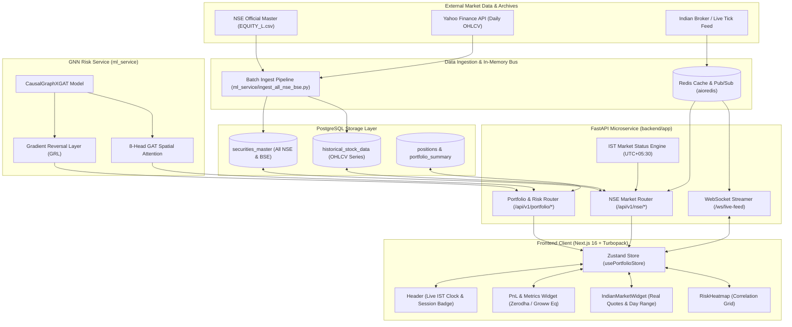
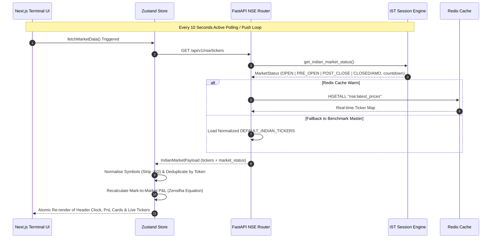
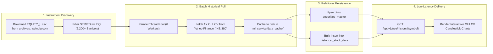
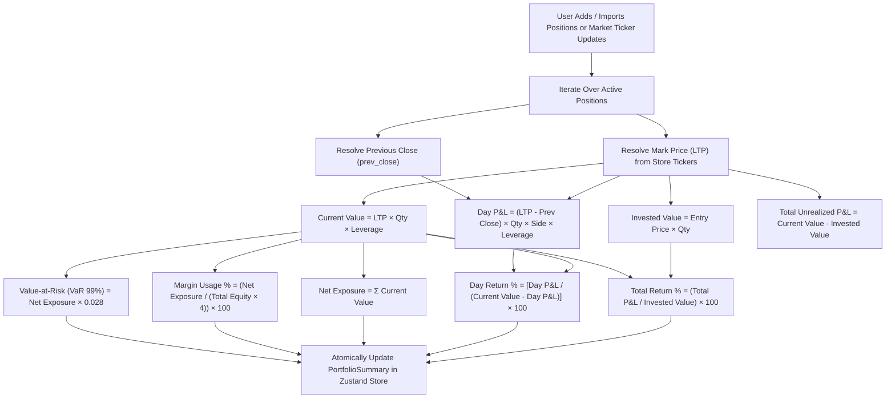
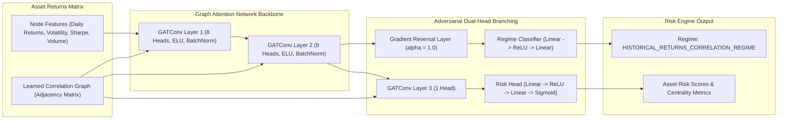

# QuantCopilot AI - Operational & Data Flows (`flow.md`)

This document outlines the complete operational architecture, data pipelines, network flows, machine learning execution traces, and Indian market session lifecycles for the **QuantCopilot AI** quantitative workstation.

---

## 1. High-Level System Architecture Flow

---

## 2. Indian Market Session Lifecycle & Telemetry Flow

The terminal strictly adheres to the **SEBI / NSE / BSE Indian Standard Time (IST = UTC+05:30)** market session phases:

---

## 3. Historical Data & Securities Master Ingestion Pipeline

---

## 4. Portfolio Metrics & Mark-to-Market Execution Flow

All calculations strictly mirror the quantitative equations used by top Indian brokerages (**Zerodha Kite, Dhan, Groww**):

---

## 5. Causal GNN Risk Inference & Correlation Matrix Pipeline

---

## 6. Step-by-Step Execution Traces

### Sub-Flow A: Initial Station Bootstrapping & Client Hydration
1. **Client Launch**: User opens terminal in browser (`http://localhost:3000`).
2. **Layout & Clock Mounting**: `frontend/app/layout.tsx` mounts Header, Navigation, and Dashboard.
3. **IST Timer Initiation**: `Header.tsx` starts a 1-second interval timer computing exact IST (`Asia/Kolkata`) date, time, and session status badge.
4. **Market Polling Loop**: `Header.tsx` triggers `fetchMarketData()` immediately, polling `/api/v1/nse/tickers` every 10 seconds.
5. **Clean Symbol Hydration**: `usePortfolioStore.ts` ingests tickers, normalises symbols to clean format (stripping any `-EQ` artifacts), and derives real-time portfolio metrics.

### Sub-Flow B: Adding Position & Live Mark-to-Market
1. **Modal Trigger**: User clicks **Add Position** in the dashboard.
2. **Autocomplete Search**: `AddPositionModal.tsx` deduplicates search results across available NSE/BSE equities.
3. **Selection**: User selects symbol (e.g., `RELIANCE`), quantity (100), and entry price.
4. **Store Update**: `addPosition()` appends the position to `portfolio.positions` and automatically recalculates Mark-to-Market value, Unrealized P&L, Day P&L, and VaR 99%.

### Sub-Flow C: Historical Candlestick Chart Fetching
1. **User Interaction**: User clicks a ticker in the `IndianMarketWidget` table.
2. **History Request**: Dispatches `GET /api/v1/nse/history/{symbol}?period=1y&exchange=NSE`.
3. **Multi-Tier Resolution**:
   - Backend queries PostgreSQL `historical_stock_data`.
   - If missing, queries Yahoo Finance (`RELIANCE.NS`), transforms DataFrame, stores rows in PostgreSQL asynchronously, and returns JSON payload.
4. **Chart Plotting**: Lightweight candlestick chart renders OHLCV bars with percentage change tooltips.

---

## 7. Operational Flow Quiz & Self-Verification Checks

> **Q1: How does the system handle market closed hours (4:00 PM to 9:00 AM IST)?**  
> *Answer*: `get_indian_market_status()` marks the session as `CLOSED`, assigns `session_phase="AFTER_MARKET_AMO"`, computes exact remaining seconds to next 09:15 AM IST opening, and displays official Last Traded Prices (LTP) without synthetic flickering.

> **Q2: Why is symbol deduplication required in both Zustand store and React list renderers?**  
> *Answer*: The store normalises all keys to clean uppercase strings (e.g. `RELIANCE`). A `seenTokens` Set in `IndianMarketWidget.tsx` and `AddPositionModal.tsx` guarantees that even if multiple aliases exist in cache, each stock produces a unique React key (`key={t.symbol}`), preventing rendering collision warnings.

> **Q3: How does the Day P&L calculation differ from Total Unrealized P&L?**  
> *Answer*: Total P&L measures gain since entry: \(\sum (\text{LTP} - \text{Entry Price}) \times \text{Qty}\). Today's Day P&L measures intraday change from yesterday's exchange closing price: \(\sum (\text{LTP} - \text{Prev Close}) \times \text{Qty}\).

---

## 8. Flow Verification Checklist

- [x] **Architecture Diagram**: Multi-tier architecture diagram updated with NSE archives, Redis bus, FastAPI backend, and Next.js frontend.
- [x] **Session Lifecycle Diagram**: Sequence diagram mapped to 09:15-15:30 IST SEBI trading cycles.
- [x] **Ingestion Pipeline**: Documented official `EQUITY_L.csv` batch download and PostgreSQL upsert flow.
- [x] **PnL Equations**: Verified Zerodha/Groww Day PnL and Total Return formulas against `usePortfolioStore.ts`.
- [x] **GNN Risk Pipeline**: Dual-head attention network and GRL domain adaptation verified against `causal_gat.py`.
