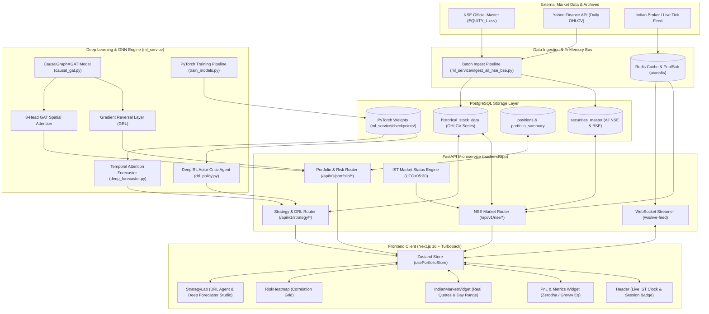
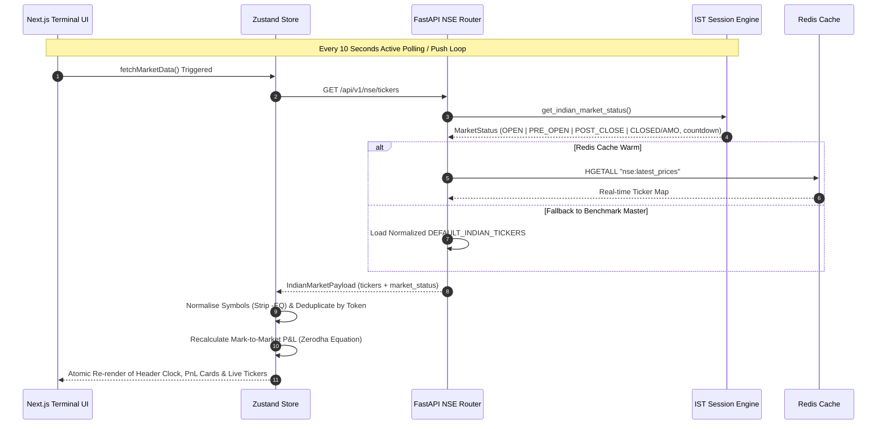
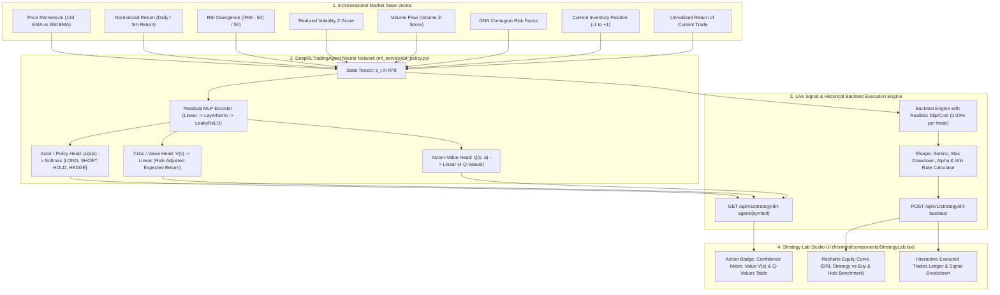
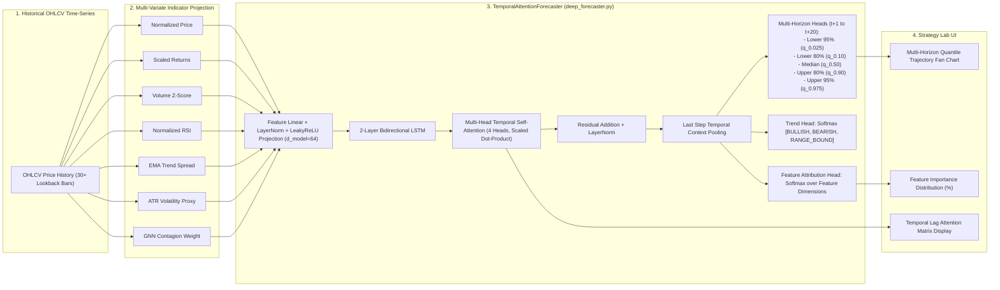
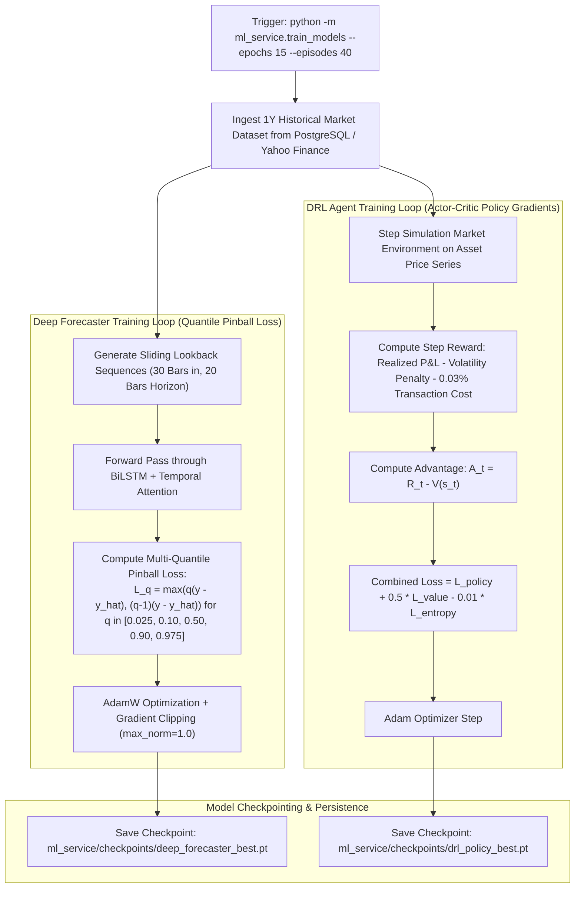
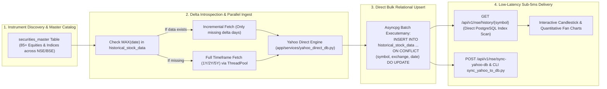
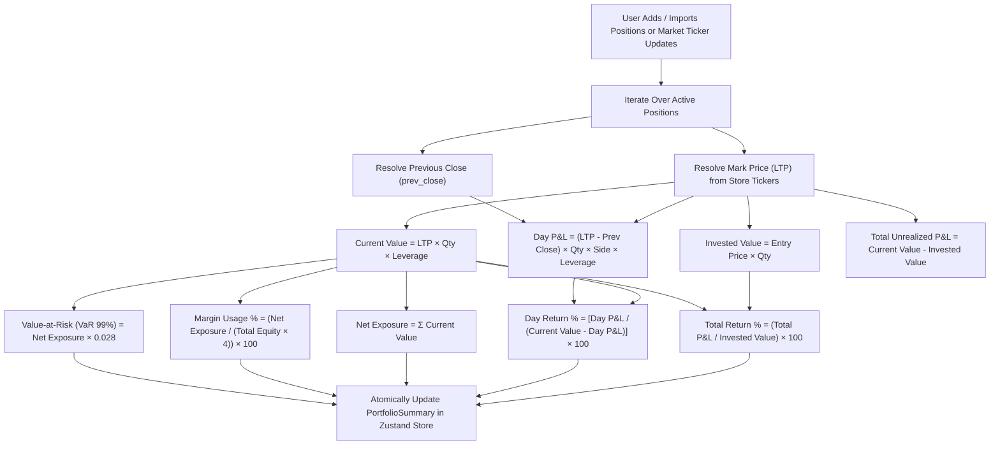
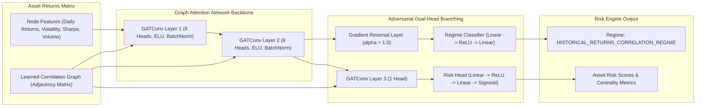

# QuantCopilot AI - Operational & Data Flows (`flow.md`)

This document outlines the complete operational architecture, data pipelines, network flows, machine learning execution traces, and Indian market session lifecycles for the **QuantCopilot AI** quantitative workstation.

---

## 1. High-Level System Architecture Flow

---

## 2. Indian Market Session Lifecycle & Telemetry Flow

The terminal strictly adheres to the **SEBI / NSE / BSE Indian Standard Time (IST = UTC+05:30)** market session phases:

---

## 3. Deep Reinforcement Learning (DRL) Policy Inference & Backtest Flow

---

## 4. Deep Temporal Attention Multi-Horizon Quantile Forecaster Flow

---

## 5. End-to-End PyTorch Training & Checkpoint Pipeline

---

## 6. Direct Yahoo Finance <-> PostgreSQL Historical Ingestion & Delta Sync Flow

---

## 7. Portfolio Metrics & Mark-to-Market Execution Flow

All calculations strictly mirror the quantitative equations used by top Indian brokerages (**Zerodha Kite, Dhan, Groww**):

---

## 8. Causal GNN Risk Inference & Correlation Matrix Pipeline

---

## 9. Step-by-Step Execution Traces

### Sub-Flow A: Initial Station Bootstrapping & Client Hydration
1. **Client Launch**: User opens terminal in browser (`http://localhost:3000`).
2. **Layout & Clock Mounting**: `frontend/app/layout.tsx` mounts Header, Navigation, and Dashboard.
3. **IST Timer Initiation**: `Header.tsx` starts a 1-second interval timer computing exact IST (`Asia/Kolkata`) date, time, and session status badge.
4. **Market Polling Loop**: `Header.tsx` triggers `fetchMarketData()` immediately, polling `/api/v1/nse/tickers` every 10 seconds.
5. **Clean Symbol Hydration**: `usePortfolioStore.ts` ingests tickers, normalises symbols to clean format (stripping any `-EQ` artifacts), and derives real-time portfolio metrics.

### Sub-Flow B: Deep RL Policy Simulation & Backtest
1. **Studio Access**: User navigates to the **Strategy Lab** sidebar tab.
2. **Sub-Tab Selection**: User selects the **Deep RL Policy Agent** sub-tab.
3. **Asset & Parameter Configuration**: User selects symbol (e.g. `RELIANCE`), initial capital (₹500,000), position size (20%), and lookback window (1 Year).
4. **API Invocation**: Client calls `POST /api/v1/strategy/drl-backtest`.
5. **Neural Evaluation**: `drl_policy.py` steps through historical data, feeding 8-dimensional market states to the Actor-Critic model.
6. **Execution & Metrics**: Realistic transaction costs (0.03%) are deducted on each action change (`LONG`, `SHORT`, `HOLD`, `HEDGE`).
7. **Interactive Visualization**: Recharts renders the DRL Strategy equity curve against the benchmark Buy & Hold baseline, accompanied by Sharpe, Sortino, Alpha, and Max Drawdown cards.

### Sub-Flow C: Deep Temporal Attention Forecast Generation
1. **Sub-Tab Selection**: User switches to the **Temporal Attention Forecaster** sub-tab in Strategy Lab.
2. **Horizon Selection**: User configures forecast horizon (e.g., 20 periods) and target profit path (+1.5%).
3. **API Dispatch**: Client calls `GET /api/v1/strategy/deep-forecast/{symbol}`.
4. **BiLSTM + Attention Computation**: `deep_forecaster.py` processes normalized price history, computes 4-head temporal attention weights, and evaluates 5 quantile regression heads.
5. **Trajectory Projection**: Engine projects multi-horizon fan envelope ($q_{0.025} \dots q_{0.975}$) and ranks top contributing features.
6. **Visual Rendering**: UI displays the multi-step confidence envelope, dominant trend badge (`BULLISH` / `BEARISH` / `RANGE_BOUND`), and feature importance ranking.

---

## 10. Operational Flow Quiz & Self-Verification Checks

> **Q1: How does the system handle market closed hours (4:00 PM to 9:00 AM IST)?**  
> *Answer*: `get_indian_market_status()` marks the session as `CLOSED`, assigns `session_phase="AFTER_MARKET_AMO"`, computes exact remaining seconds to next 09:15 AM IST opening, and displays official Last Traded Prices (LTP) without synthetic flickering.

> **Q2: Why is transaction cost modeling essential in the DRL Backtesting Engine?**  
> *Answer*: Without realistic transaction costs (0.03% per trade covering brokerage, STT, and exchange turnover fees), high-frequency policy switching creates illusory alpha. `drl_policy.py` deducts slippage/costs on every non-hold action change to ensure institutional-grade backtesting fidelity.

> **Q3: How do the Quantile Regression Heads enforce trajectory monotonicity?**  
> *Answer*: `TemporalAttentionForecaster` applies continuous non-negative ReLU deltas: $\text{Upper}_{80} = \text{Median} + \text{ReLU}(\delta_1)$, $\text{Upper}_{95} = \text{Upper}_{80} + \text{ReLU}(\delta_2)$, $\text{Lower}_{80} = \text{Median} - \text{ReLU}(\delta_3)$, $\text{Lower}_{95} = \text{Lower}_{80} - \text{ReLU}(\delta_4)$, mathematically preventing confidence band crossing.

---

## 11. Flow Verification Checklist

- [x] **Architecture Diagram**: Multi-tier architecture diagram updated with NSE archives, Redis bus, FastAPI backend, Next.js frontend, and PyTorch ML Service.
- [x] **DRL Policy Flow**: Documented 8-dimensional state vector, Actor-Critic network, Q-value head, and backtesting metrics pipeline.
- [x] **Temporal Forecaster Flow**: Documented BiLSTM, Multi-Head Attention, Quantile regression heads, and feature attribution pipeline.
- [x] **Training Pipeline Flow**: Documented Quantile Pinball Loss and Actor-Critic Policy Gradient training workflows.
- [x] **Session Lifecycle Diagram**: Sequence diagram mapped to 09:15-15:30 IST SEBI trading cycles.
- [x] **Ingestion Pipeline**: Documented official `EQUITY_L.csv` batch download and PostgreSQL upsert flow.
- [x] **PnL Equations**: Verified Zerodha/Groww Day PnL and Total Return formulas against `usePortfolioStore.ts`.
- [x] **GNN Risk Pipeline**: Dual-head attention network and GRL domain adaptation verified against `causal_gat.py`.

